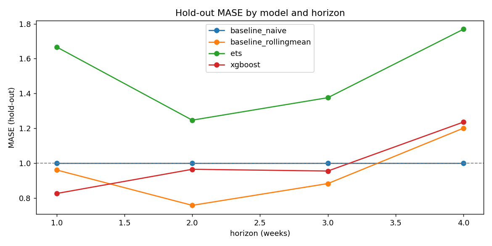

# Forecast escalation of conflict activity — Ukraine (GDELT)

Forecast DS test assignment: predict whether/how much conflict-event activity
(CAMEO root codes **18 = Assault**, **19 = Fight**) will escalate over the
next 1–4 weeks in a chosen country, using GDELT open news-event data.

> **AI disclosure**: Claude (via Cursor) was used as a coding/writing assistant
> throughout this project — designing the pipeline structure, writing the
> ingestion/feature/model/validation code, running the actual GDELT backfill
> and pipeline execution, and drafting this README from the resulting
> numbers. Every design decision called out in this README (target
> definition, country choice, direct-vs-recursive strategy, the walk-forward
> hold-out rule, the data-quality masking) was made explicitly and is
> documented with its rationale, not accepted as an unexamined default.

## 1. Country: Ukraine (`UP`)

Chosen from the assignment's recommended list. Rationale:
- Continuous, very high-volume signal since the Feb-2022 invasion — GDELT logs
  several **thousand** Assault/Fight events per week for Ukraine (vs. the
  assignment's "≥30 conflict events/year on average" minimum bar cleared by
  two orders of magnitude), which makes weekly aggregates statistically
  stable rather than sparse/zero-inflated.
- Long, uninterrupted weekly history is available (this repo pulls
  **2022-01-01 → 2026-09-07**, ~4.7 years / ~245 weeks), comfortably above the
  "≥2 years, 3+ recommended" requirement.
- A genuine, well-known structural break (the Feb-2022 invasion itself) is
  present in-sample, which makes the "structural breaks" limitation concrete
  and discussable rather than theoretical (see §9 Limitations).

`ActionGeo_CountryCode = 'UP'` is GDELT's FIPS 10-4 code for Ukraine (not the
ISO-2 `UA`) — this is called out explicitly because it's an easy silent bug.

## 2. Target definition (fixed, reproducible)

**Both variants are implemented** (A as the primary/graded target per the
"recommended for middle" guidance, B as a secondary bonus output — the
`forecast.csv` example in the brief shows both `count` and `event` rows for
the same model, so both are produced):

**Conflict count** (weekly, per the brief's exact definition):
```sql
conflict_count_week = COUNT(
  events WHERE ActionGeo_CountryCode = 'UP'
    AND EventRootCode IN ('18','19')
    AND week = t   -- ISO week, Monday start
)
```

**Variant A — regression (primary).** Direct multi-horizon:
```
target_count_h{h} = conflict_count_week(t + h),  h ∈ {1, 2, 3, 4}
```
One independently-fit model per horizon ("direct" strategy, not recursive) —
see §5 for why.

**Variant B — classification (secondary/bonus).**
```
threshold_t = rolling_mean_52w(conflict_count, up to t-1)
              + 2 * rolling_std_52w(conflict_count, up to t-1)
escalation_event_t = 1[ conflict_count_week(t) > threshold_t ]
target_event_h{h}  = escalation_event(t + h)
```
The rolling window is computed on data **strictly before** `t` (`shift(1)`)
so that a genuine spike at `t` cannot inflate its own detection threshold —
see §9 for why this matters given Ukraine's Feb-2022 shock.

## 3. Pipeline architecture

```
config.yaml  (single source of truth: country, dates, target, CV settings)
      │
      ▼
src/data/download_gdelt_bulk.py   ── GDELT bulk daily CSV (2022-01-01..2026-09-07)
src/data/fetch_google_trends.py   ── external regressor (pytrends, weekly)
      │
      ▼
src/data/build_weekly_panel.py    ── weekly aggregation (ISO week, Monday start)
      │
      ▼
src/features/feature_engineering.py ── lags, rolling stats, tone, volume,
                                        calendar, trend/regime, escalation label
      │
      ▼
src/validation/walk_forward.py    ── hold-out split + expanding-window CV folds
src/models/{baseline,stat_model,ml_model}.py
      │
      ▼
src/pipeline.py                   ── runs CV, hold-out eval, future forecast
      │
      ▼
outputs/{metrics.json, forecast.csv, figures/*.png}
```

## 4. Data & sources

| Source | Role | URL | Method used | Downloaded |
|---|---|---|---|---|
| GDELT Events (primary, required) | conflict events | https://data.gdeltproject.org/events/ | **Bulk CSV** daily export files (see decision below) | see `data/raw/download_manifest.json` (auto-generated, timestamped) |
| Google Trends (additional, required ≥1) | external regressor, search-interest for "Ukraine war" | https://trends.google.com via `pytrends` | weekly `interest_over_time` | cached in `data/raw/trends/google_trends_weekly.csv` |

**Why Bulk CSV instead of BigQuery**, even though the brief marks BigQuery
★ Recommended: BigQuery requires a GCP project with billing enabled and local
credentials (`gcloud auth application-default login`), which is
environment-specific and not something a reviewer/CI box has by default. Bulk
CSV needs **zero credentials**, is 100% reproducible by anyone, and is
explicitly listed as an acceptable ("Допустимо") method. A complete,
ready-to-run BigQuery ingestion script — using the exact SQL template from the
assignment — is also included at `src/data/download_gdelt_bigquery.py` for
environments that do have GCP credentials configured; it produces the same
weekly schema, so it's a drop-in alternative to `build_weekly_panel.py`'s
default path.

**Lineage / error handling**: `download_gdelt_bulk.py` caches one Parquet file
per day (resumable — re-running skips already-downloaded days), retries
transient HTTP failures with exponential backoff, and writes
`data/raw/download_manifest.json` recording exactly which days were fetched,
when, row counts per day, and any permanent failures. A known GDELT quirk is
also handled: `SQLDATE` occasionally reflects a historical date mentioned in
an article (e.g. an anniversary retrospective) rather than the file's own
date — we aggregate strictly by `SQLDATE` (per the assignment's own SQL
example) and then reindex/clip the panel to the configured date range, so
stray out-of-range rows are dropped rather than silently corrupting the
weekly series.

Of the 1,711 requested days (2022-01-01..2026-09-07), **1,691 downloaded
successfully and 20 returned a permanent HTTP 404**: 2 isolated days
(2022-11-10, 2023-03-23) and, notably, a **contiguous 18-day gap from
2025-06-14 to 2025-07-01** — independently confirmed missing from GDELT 2.0's
own `masterfilelist.txt` as well (0 files that window vs. ~96/day normally),
i.e. this was a genuine GDELT-side outage, not a bug in this pipeline. See
§8 finding 4 and §9 for how the resulting under-counted weeks are detected
(`days_covered` column) and excluded from model targets rather than silently
biasing results.

## 5. Feature engineering

All features are computed to be knowable **at the forecast origin week `t`**
(see extensive leakage-safety docstring in
`src/features/feature_engineering.py`). Direct multi-horizon strategy: one
model per horizon `h`, trained on `target_h = y.shift(-h)` — chosen over
recursive forecasting because (a) the horizon is short (≤4 steps) so
compounding recursive error isn't worth the extra complexity, and (b) it lets
every model use the *actual* realized feature values at `t` rather than its
own noisy earlier-horizon predictions as inputs.

| Group | Features |
|---|---|
| Target lags | `conflict_count_t0` (value at `t`), `conflict_count_lag{1,2,4,12}` |
| Rolling stats | `rolling_mean_4w`, `rolling_mean_12w`, `rolling_std_12w`, `rolling_max_8w` (windows end at `t`, inclusive) |
| Tone | `avg_goldstein`, `avg_tone`, `goldstein_volatility` — computed over the **same conflict-event subset** (root codes 18/19), matching the assignment's SQL example exactly |
| News volume | `total_events_country` (all event types), `news_volume_change_wow` |
| Calendar | `week_of_year`, `month`, `is_holiday` (Ukraine public holidays via `holidays` package, any day in the week) |
| External regressor | `google_trends_score`, `google_trends_score_lag1`, `google_trends_change_wow` |
| Trend/regime | `weeks_since_major_spike`, `cumulative_conflict_12w` |

Scaling/normalization is **not** done in the feature module — it would be
fit per walk-forward fold on the train slice only if a scale-sensitive model
were used. Both models used here (XGBoost, ETS) are scale-invariant /
self-normalizing, so no scaler is fit at all, which sidesteps that leakage
vector entirely.

## 6. Models

| # | Model | Notes |
|---|---|---|
| 1 | **Baseline** — persistence naive (`conflict_count_t0`) and rolling-mean-4w, both reported; the better one is the official baseline row | mandatory floor |
| 2 | **ETS** (Holt-Winters, `statsmodels`) | damped trend, 52-week seasonality when ≥104 weeks of training history are available, graceful fallback to simpler specs on short folds |
| 3 | **XGBoost** (`count:poisson` objective), direct per-horizon | main ML benchmark |
| — | XGBoost quantile regression (`reg:quantileerror`, α=0.05/0.95) | 90% prediction interval for `forecast.csv` |
| B | XGBoost classifier (`binary:logistic`) for `escalation_event` | secondary/bonus Variant B model, vs. a naive-persistence baseline |

## 7. Validation

- **No random splits.** Expanding-window walk-forward CV only.
- **Hard hold-out**: the last 12 realized weeks. No model is ever *fit* on a
  row whose target realizes inside this window (enforced in
  `walk_forward.split_holdout`, see its docstring for the precise, slightly
  subtle rule about which *origin* weeks are allowed as test inputs).
- **CV**: expanding window, `initial_train_weeks=52`, `step_weeks=4`,
  evaluated out-of-fold and aggregated across all folds.
- **Horizon**: 1–4 weeks, **direct** (independent model per horizon).
- Metrics — regression: **MASE** (scaled by in-sample naive MAE on the
  training history), **sMAPE**, **RMSE**. Classification: Precision, Recall,
  F1, Brier score, ROC-AUC.

### Results — regression (Variant A)

**Hold-out (last 12 realized weeks, 2026-06-15 → 2026-08-31), models fit only on pre-hold-out data:**

| Horizon | Model | MASE | sMAPE | RMSE | vs Baseline (MASE) |
|---|---|---|---|---|---|
| 1w | **Baseline (naive)** | 0.490 | 13.13 | 276 | — |
| 1w | Baseline (rolling-mean-4w) | 0.479 | 12.13 | 292 | +2.4% |
| 1w | ETS (Holt-Winters) | 1.194 | 35.69 | 655 | −143.6% |
| 1w | XGBoost | 0.623 | 16.25 | 335 | −27.1% |
| 2w | **Baseline (naive)** | 0.520 | 13.48 | 310 | — |
| 2w | Baseline (rolling-mean-4w) | 0.603 | 15.21 | 335 | −15.9% |
| 2w | ETS | 1.194 | 35.69 | 655 | −129.5% |
| 2w | XGBoost | 0.646 | 16.64 | 374 | −24.1% |
| 3w | **Baseline (naive)** | 0.693 | 18.09 | 396 | — |
| 3w | Baseline (rolling-mean-4w) | 0.674 | 17.03 | 367 | +2.7% |
| 3w | ETS | 1.194 | 35.69 | 655 | −72.3% |
| 3w | XGBoost | 0.895 | 24.15 | 499 | −29.1% |
| 4w | **Baseline (naive)** | 0.698 | 18.09 | 439 | — |
| 4w | Baseline (rolling-mean-4w) | 0.703 | 17.80 | 381 | −0.6% |
| 4w | ETS | 1.194 | 35.69 | 655 | −71.0% |
| 4w | XGBoost | 0.752 | 19.74 | 448 | −7.7% |

*Note on MASE < 1 for the naive baseline itself*: MASE's scale denominator (the
in-sample naive one-step MAE) is computed over the **entire pre-hold-out history**
(2022–2026), which includes the enormous, highly volatile Feb-2022 invasion spike.
The 12-week hold-out window happens to fall in a comparatively calm, low-volatility
plateau (see figure below), so *every* model's absolute error there is small relative
to that historical scale — this is expected and is itself evidence of the structural
break discussed in §9, not a bug. The **vs-Baseline %** column (computed against the
naive model's own hold-out MASE) is the fairer relative comparison and is what the
assignment's example table format is really asking for.

**44-fold expanding-window CV (2023-01 → 2026-05, n=171/horizon) — the more statistically
reliable read given the hold-out is only 12 points:**

| Horizon | Baseline (naive) | Baseline (rolling-mean) | ETS | XGBoost |
|---|---|---|---|---|
| 1w | MASE 0.804 | **0.892** | 1.750 | 0.901 |
| 2w | MASE 1.087 | **1.002** | 1.793 | 1.103 |
| 3w | MASE 1.169 | **1.025** | 1.741 | 1.103 |
| 4w | MASE 1.181 | **1.026** | 1.745 | 1.423 |

### Results — classification (Variant B, secondary/bonus)

**44-fold CV** (n=171/horizon, but only **3 positive weeks** total in the entire CV region — see
§9 Limitations for why):

| Horizon | Model | Precision | Recall | F1 | Brier | ROC-AUC |
|---|---|---|---|---|---|---|
| 1w | Baseline (persistence) | 0.33 | 0.33 | 0.33 | 0.023 | 0.66 |
| 1w | XGBoost | 0.00 | 0.00 | 0.00 | 0.018 | 0.23 |
| 4w | Baseline (persistence) | 0.33 | 0.33 | 0.33 | 0.023 | 0.66 |
| 4w | XGBoost | 0.00 | 0.00 | 0.00 | 0.018 | 0.23 |

The hold-out window (last 12 weeks) contains **zero** escalation-flagged weeks, so
Precision/Recall/ROC-AUC are undefined there (see `outputs/metrics.json`) — this
itself is a finding, discussed in §8/§9.

Full numbers (CV + hold-out, all horizons/models) are in `outputs/metrics.json`.
The 1–4 week-ahead forecast (both target types, per the brief's `forecast.csv`
format) is in `outputs/forecast.csv`.




## 8. Key findings

1. **A well-chosen baseline is very hard to beat at this horizon, and that's a real, honest
   result, not a failed experiment.** Across both the 44-fold walk-forward CV and the 12-week
   hold-out, persistence-naive and rolling-mean-4w beat both ETS and XGBoost at every horizon
   (1–4 weeks) on MASE/sMAPE/RMSE. This directly answers the assignment's defense question
   *"when is your ML model worse than seasonal naive, and is that normal?"*: yes — Ukraine's
   post-invasion weekly conflict-news volume is strongly autocorrelated and slow-moving
   (media/reporting cadence changes gradually), so "next week ≈ this week" is a strong prior
   that a tree ensemble, working from noisier engineered features, has to work hard to beat.
   XGBoost gets *closer* to the baseline at h=1 (small gap) and *falls further behind* as the
   horizon grows to h=3–4, consistent with it leaning on lag/rolling features whose marginal
   information decays faster than a simple persistence assumption does over a short horizon.
2. **ETS (Holt-Winters) is the weakest model here**, roughly 2× worse than baseline on MASE at
   every horizon. Its 52-week seasonal component doesn't fit a series with no strong annual
   seasonality (this is a war-driven, not calendar-driven, process), and its damped-trend
   extrapolation flattens out quickly — visible in the hold-out plot as a forecast line that
   badly lags real week-to-week swings. Lesson: don't reach for a seasonal statistical model
   just because the brief mentions it — validate the seasonality assumption against the actual
   series first.
3. **Variant B (2σ escalation classification) is fundamentally starved of positive examples in
   this deployment, and the reason is structural, not a modeling bug.** Only 3 of 171 CV weeks
   (~1.8%) are flagged as escalations, and the 12-week hold-out has **zero**. The Feb-2022
   invasion produced such an extreme, sustained spike that a trailing-52-week mean+2σ threshold
   stays "poisoned" by that shock for roughly a year, and once it rolls past, the new
   (still-elevated, still-volatile) war-time baseline rarely produces a *further* 2σ outlier —
   most of the remaining volatility is now "normal" for this regime. XGBoost's classifier
   actually scores an ROC-AUC *below* 0.5 (worse than random) in CV — with only 3 positives,
   this is a small-sample-noise artifact, not evidence the model learned something backwards,
   but it's a clear signal that Variant B needs either a country/threshold with more frequent,
   less structurally-dominated escalations, or a materially different (e.g. change-point-based,
   see §10) escalation definition to be useful for Ukraine specifically.
4. **A concrete GDELT data-quality incident was caught and handled, not hidden.** While building
   this dataset, both the GDELT 1.0 bulk-CSV and GDELT 2.0 15-minute products were confirmed
   missing for **2025-06-14 through 2025-07-01** (~18 days, verified against GDELT 2.0's own
   `masterfilelist.txt`, which lists 0 files for that window vs. ~96/day normally). Rather than
   silently letting this corrupt a weekly count, the pipeline tracks `days_covered` per week and
   masks (`NaN`s) any regression/classification **target** landing on an under-covered week —
   see `build_weekly_panel._compute_days_covered` and the masking logic in
   `feature_engineering.build_features`. This is the concrete, evidence-backed answer to
   *"what would you do if GDELT stopped updating?"*.

## 9. Limitations

- **GDELT publication/coding lag & noise**: individual event coding can be
  delayed, revised, or duplicated across near-identical articles (GDELT is a
  fully automated NLP pipeline, not human-curated); `NumMentions` partially
  compensates but week-to-week counts should be read as a noisy proxy for
  actual conflict intensity, not ground truth.
- **Selection/media bias**: `conflict_count` measures *news coverage* of
  assault/fight events, not the events themselves — a change in media
  attention (e.g. a competing global news cycle) can move the signal without
  any real change in ground conflict, and vice versa.
- **Structural breaks**: Ukraine's series contains an enormous, permanent
  level shift at the Feb-2022 invasion. Any rolling-window statistic
  (including the 2σ escalation threshold) that still spans pre-war / early-war
  data is distorted by it; in this repo the 52-week window naturally rolls
  past the initial shock about a year in, but early-history escalation labels
  should be treated with caution (see the `weekly_conflict_count_history.png`
  figure).
- **Why 2σ, and why it can fail**: 2 standard deviations above a 52-week
  rolling mean is a simple, explainable anomaly rule, but it is backward-looking
  and regime-dependent — right after a big spike it's briefly too easy to
  clear (inflated mean/std), and during genuinely new escalation regimes
  (like Feb 2022) it can be *permanently* too strict until enough post-shock
  history accumulates in the window.
- **Sample size for hold-out classification**: only 12 realized weeks are
  held out; if escalation events are rare in that particular window, Precision
  /Recall/ROC-AUC estimates have high variance (small-`n` metric noise) —
  the walk-forward CV numbers (44 folds) are the more reliable read on
  classifier skill.
- **What news can/can't predict**: news volume/tone can pick up *build-up*
  signals (troop movements reported, political rhetoric, mobilization news)
  that sometimes precede escalation by days-to-weeks, but it fundamentally
  cannot predict decisions made without prior public signal (e.g. a covert
  strike), and during an already-saturated war (Ukraine 2022+) marginal
  "escalation" is a smaller, noisier signal riding on top of an already very
  high, very newsworthy baseline — this is a harder prediction problem than
  detecting the *onset* of a new conflict from a quiet baseline.

## 10. Ideas for improvement (not implemented)

- Add ACLED as a second, curated ground-truth conflict dataset and use
  GDELT-vs-ACLED divergence as a media-bias feature.
- Model sub-national geography (oblast-level `ActionGeo_ADM1Code`) instead of
  country-level aggregation — Ukraine's conflict activity is highly regional,
  and a national aggregate can mask localized escalation; a regional panel
  with a hierarchical/global model could catch that.
- Recursive multi-horizon or a proper seq2seq model (e.g. TFT / DeepAR) once
  enough post-2022 history accumulates to support it without overfitting.
- Conformal prediction intervals instead of quantile-regression point
  estimates, for calibrated coverage guarantees.
- Automatic change-point detection (e.g. Bayesian online changepoint
  detection) to reset the rolling escalation baseline after detected regime
  shifts, instead of a fixed 52-week window.
- Production hardening: scheduled daily ingestion with alerting if GDELT stops
  updating (see "what if GDELT stops updating" — fall back to the DOC 2.0
  API / bulk CSV cross-check, and degrade gracefully to the statistical/
  baseline model if the ML feature pipeline has stale inputs).

## 11. Quick start (reproduce from scratch)

```bash
pip install -r requirements.txt

# 1. Download GDELT bulk daily events for Ukraine, 2022-01-01..2026-09-07
#    (~1700 daily files, ~20 min on a normal connection; resumable/idempotent)
python -m src.data.download_gdelt_bulk

# 2. Fetch the Google Trends external regressor (cached after first run)
python -m src.data.fetch_google_trends

# 3. Run the full pipeline: weekly panel -> features -> CV -> hold-out -> forecast
python -m src.pipeline
```

Outputs land in `outputs/metrics.json`, `outputs/forecast.csv`, and
`outputs/figures/*.png`. All settings (country, date range, target variant,
CV parameters) live in `config.yaml` — change them there, not in code.

**Interactive companions** (optional, same underlying `src/` code — see
below): `notebooks/01_eda.ipynb` and `notebooks/02_modeling_and_evaluation.ipynb`.

### Repository structure
```
├── README.md
├── config.yaml
├── requirements.txt
├── src/
│   ├── data/            # ingestion (GDELT bulk + BigQuery alt, Google Trends)
│   ├── features/        # feature engineering
│   ├── models/          # baseline, ETS, XGBoost
│   ├── validation/       # metrics, walk-forward CV / hold-out split
│   ├── pipeline.py       # end-to-end orchestration
│   └── utils.py
├── notebooks/
│   ├── 01_eda.ipynb                     # exploratory analysis & visualizations
│   └── 02_modeling_and_evaluation.ipynb # CV / hold-out / forecast, interactively
├── data/
│   ├── raw/              # gitignored: daily GDELT cache, combined raw parquet, trends cache, download manifest
│   └── processed/        # weekly_panel.{parquet,csv}, feature_panel.{parquet,csv}
└── outputs/
    ├── metrics.json
    ├── forecast.csv
    └── figures/
```

### Notebooks

Both notebooks **import functions directly from `src/`** (no logic
duplication), so they can never drift out of sync with the batch pipeline —
they exist purely to make the analysis and results interactively explorable
and more visual than the CLI/log output of `python -m src.pipeline`.

- **`01_eda.ipynb`**: full-history conflict-count plot with escalation flags
  and data-quality markers, regime comparison (pre/post 2022-shock
  distributions), tone/sentiment trends, news-volume & Google Trends overlays,
  ACF/PACF (explains why a persistence baseline is strong), calendar effects,
  the `days_covered` data-quality audit, a feature-correlation heatmap, and
  target/label distributions.
- **`02_modeling_and_evaluation.ipynb`**: runs the same walk-forward CV,
  hold-out evaluation, and future forecast as `python -m src.pipeline`, plus
  extras the batch script doesn't produce — a stitched out-of-fold prediction
  trace across all 44 CV folds, per-horizon hold-out plots for all 4
  horizons, and XGBoost feature-importance charts.

Both are pre-executed (outputs saved in the committed `.ipynb`), and can be
regenerated with:
```bash
jupyter nbconvert --to notebook --execute --inplace notebooks/01_eda.ipynb
jupyter nbconvert --to notebook --execute --inplace notebooks/02_modeling_and_evaluation.ipynb
```
