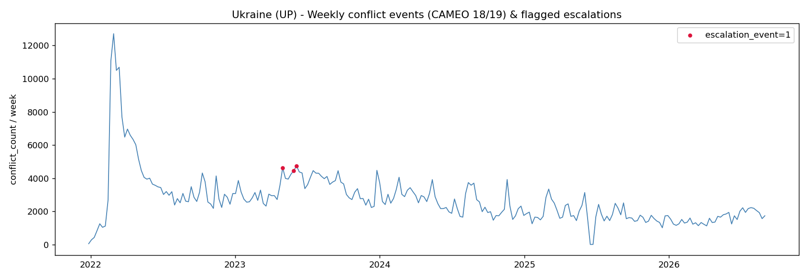
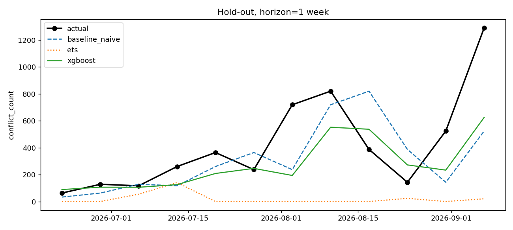

# Прогноз эскалации конфликтной активности — Йемен (GDELT)

По новостному фону прошлых недель предсказать число конфликтных событий
(CAMEO 18/19) в Йемене на горизонте 1–4 недели.

Часть кода писалась в Cursor.

## 1. Страна: Йемен (`YM`)

Из рекомендованного списка задания («стабильно высокий фон»). Гражданская
война с 2014, с конца 2023 ещё и атаки хуситов по судоходству в Красном море.
Ряд неразреженный: в среднем ~250 событий 18/19 в неделю, за год это далеко
за порог «≥30».

В GDELT страна кодируется FIPS `YM`, не ISO-2 `YE`.

Период: **2022-01-01 → 2026-09-13** (246 ISO-недель).

## 2. Target

ISO-неделя, понедельник:

```
conflict_count_week = COUNT(
  events WHERE ActionGeo_CountryCode = 'YM'
    AND EventRootCode IN ('18', '19')
    AND week = t
)
```

**Вариант A (основной)** — регрессия, direct multi-horizon:

```
target_count_h{h} = conflict_count_week(t + h),  h ∈ {1, 2, 3, 4}
```

Одна модель на горизонт. Recursive не делал: 4 шага, незачем копить ошибку h=1.

## 3. Пайплайн

```
config.yaml
  → download_gdelt_bulk.py      daily CSV, фильтр YM
  → fetch_google_trends.py      keyword «Yemen war»
  → build_weekly_panel.py       ISO week, Monday
  → feature_engineering.py
  → walk_forward.py             hold-out 12w + expanding CV
  → baseline / ETS / XGBoost
  → outputs/{metrics.json, forecast.csv, figures/}
```

## 4. Данные

| Источник | Зачем | URL | Когда |
|---|---|---|---|
| GDELT Events 1.0 | conflict_count, Goldstein, tone, объём новостей | https://data.gdeltproject.org/events/ | 2026-09-16, bulk CSV |
| Google Trends | external regressor | keyword `Yemen war`, pytrends | 2026-09-16 |

BigQuery в задании рекомендован, но нужен GCP с биллингом. Качал bulk CSV
(без учётки). Скрипт под BigQuery: `src/data/download_gdelt_bigquery.py`.

Lineage: `data/raw/download_manifest.json`. Из 1717 дней 20 вернули 404
(два одиночных + окно 2025-06-14…2025-07-01, это дыра GDELT, не баг загрузчика).
Недели с `days_covered < 7` не идут в target.

## 5. Фичи

На строке `t` только то, что известно к концу недели `t`. Future — только в
`target_*` через `shift(-h)`.

| Группа | Фичи |
|---|---|
| Лаги | `conflict_count_t0`, lag 1/2/4/12 |
| Rolling | mean 4w/12w, std 12w, max 8w |
| Tone | avg_goldstein, avg_tone, goldstein_volatility (только 18/19) |
| Объём | total_events_country, news_volume_change_wow |
| Календарь | week_of_year, month, is_holiday (праздники YE) |
| External | google_trends_score, lag1, wow |
| Trend | weeks_since_major_spike, cumulative_conflict_12w |

Скейлер не ставил: XGBoost и ETS к масштабу равнодушны.

## 6. Модели

1. Baseline: persistence (`t0`) и rolling-mean-4w
2. ETS (Holt-Winters), damped trend; сезонность 52w, если в train ≥104 недель
3. XGBoost, `count:poisson`, direct на каждый h

Для B — XGBClassifier vs persistence по флагу.

## 7. Валидация

Expanding-window walk-forward, без random split. Hold-out — последние 12
реализованных недель, модели на них не учатся. CV: initial 52w, step 4w.
Горизонт 1–4, direct.

MASE = MAE(модель) / MAE(naive) на том же окне:

| MASE | смысл |
|---|---|
| < 1 | лучше naive |
| = 1 | как naive |
| > 1 | хуже naive |
| 0 | идеальный прогноз |

### Hold-out (2026-06-22 … 2026-09-07)

| h | Model | MASE | sMAPE | RMSE | vs naive |
|---|---|---|---|---|---|
| 1 | Baseline (naive) | 1.000 | 63.96 | 326 | — |
| 1 | Baseline (mean-4w) | 0.961 | 57.73 | 335 | +3.9% |
| 1 | ETS | 1.667 | 172.48 | 538 | −67% |
| 1 | XGBoost | **0.826** | 48.77 | 283 | **+17%** |
| 2 | Baseline (naive) | 1.000 | 83.33 | 453 | — |
| 2 | Baseline (mean-4w) | **0.758** | 67.82 | 349 | **+24%** |
| 2 | ETS | 1.247 | 172.48 | 538 | −25% |
| 2 | XGBoost | 0.965 | 78.41 | 428 | +3.5% |
| 3 | Baseline (naive) | 1.000 | 77.14 | 387 | — |
| 3 | Baseline (mean-4w) | **0.883** | 80.89 | 352 | **+12%** |
| 3 | ETS | 1.376 | 172.48 | 538 | −38% |
| 3 | XGBoost | 0.955 | 77.20 | 395 | +4.5% |
| 4 | Baseline (naive) | **1.000** | 78.09 | 304 | — |
| 4 | Baseline (mean-4w) | 1.201 | 89.32 | 370 | −20% |
| 4 | ETS | 1.769 | 172.48 | 538 | −77% |
| 4 | XGBoost | 1.236 | 77.38 | 408 | −24% |

### CV (44 фолда, n=171 / горизонт)

| h | naive | mean-4w | ETS | XGBoost |
|---|---|---|---|---|
| 1 | **1.000** | 1.210 | 1.562 | 1.113 |
| 2 | 1.000 | 0.993 | 1.157 | **0.956** |
| 3 | 1.000 | 0.928 | 1.045 | **0.819** |
| 4 | 1.000 | 0.900 | 1.002 | **0.752** |

Классификация (CV, 24 позитива из 171): persistence на h=1 даёт F1 0.67,
XGBoost — 0.41 при почти том же AUC (~0.81). На hold-out 5 эскалаций из 12,
оценки шумные.

Полные цифры: `outputs/metrics.json`. Прогноз: `outputs/forecast.csv`.





## 8. Три вывода

1. **Baseline на этом ряде сильный, и это нормально.** На CV h=1 persistence
   лучше XGBoost. На hold-out XGB выигрывает h=1 (+17% к naive), но уже на h=4
   проигрывает. Ряд сильно автокоррелирован: «следующая неделя ≈ эта» —
   трудный пол. Где XGB стабильно лучше naive — это CV на h=3–4: там
   persistence уже не держит, а лаги/rolling ещё что-то дают.
2. **ETS здесь лишний.** Годовая сезонность к войне не приклеена. Модель
   рисует почти плоский прогноз и проигрывает всем.
3. **2σ-эскалация на Йемене живее, чем на «вечной войне».** ~12% недель
   помечаются как spike (29 из 246), не 1–2%. Последняя неделя ряда — 1291
   событие при медиане 146, поэтому в `forecast.csv` P(event) высокий: модель
   видит, что текущий уровень уже над порогом. Это не «модель уверена в новой
   войне», а следствие определения порога.

## 9. Limitations

- GDELT считает новостное покрытие, не события на земле. Смена медиафокуса
  двигает ряд без изменения интенсивности боёв.
- Автокодировка: дубли статей, ретроспективные SQLDATE, лаги публикации.
- 2σ от 52 недель — простой порог, но после долгого высокого режима
  «аномалия» становится нормой, и наоборот.
- Hold-out 12 точек. Смотреть лучше CV.
- Новости плохо предсказывают решения без публичного следа (скрытый удар,
  внезапное перемирие).

## 10. Что бы добавил

- ACLED как второй ground truth и фича расхождения с GDELT.
- Не страна целиком, а губернаторства (`ActionGeo_ADM1Code`).
- Conformal intervals вместо residual ±1.645σ.
- Алерт, если GDELT перестал обновляться (`days_covered` уже считается).

## 11. Запуск

```bash
pip install -r requirements.txt
python -m src.data.download_gdelt_bulk
python -m src.data.fetch_google_trends
python -m src.pipeline
```

Страна, даты, CV — в `config.yaml`.
